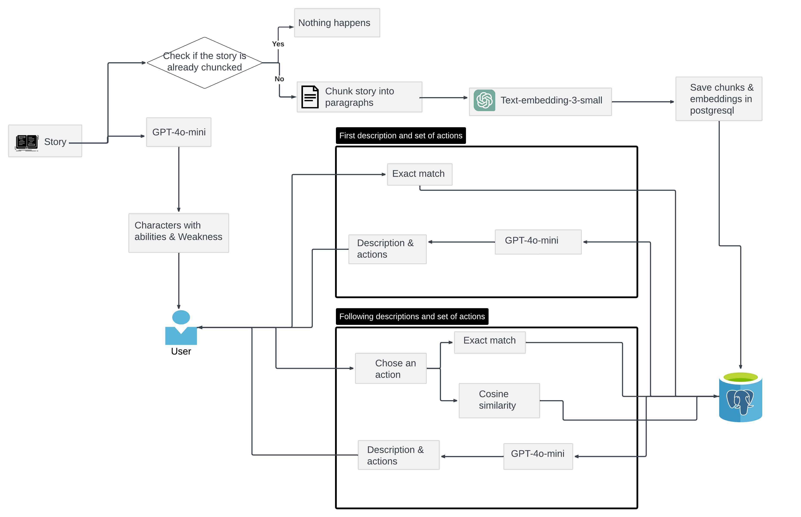
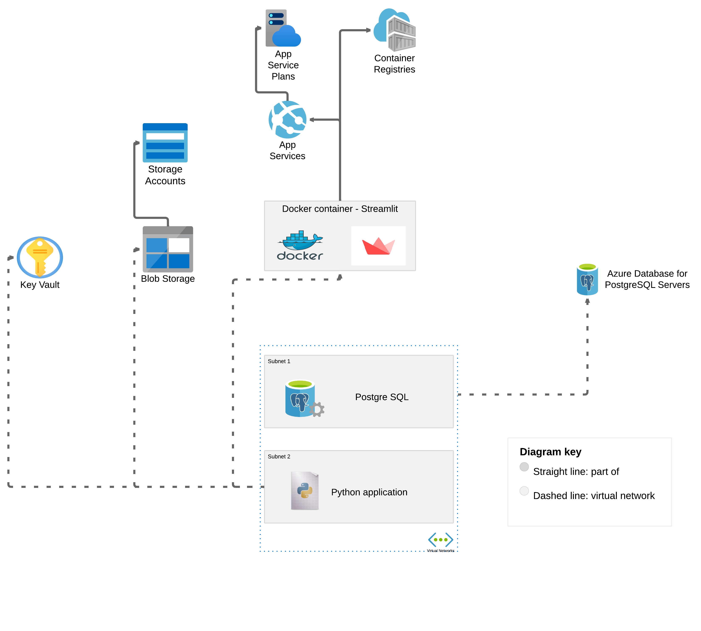

# StoryWeave
An interactive text-based game that is using a base story for action generation

StoryWeave is an interactive, AI-powered storytelling platform that allows users to play through a dynamic, custom-built narrative where their decisions shape the story. Using Retrieval-Augmented Generation (RAG) and Azure, players choose their own adventure, guiding them through a series of steps where each choice weaves the plot in new directions. Every decision influences the journey, creating a personalized experience that evolves at every turn.

## Table of Contents
* [The Use Case](#The-use-case)
* [Description of the game](#Description-of-the-game)
* [Architecture overview On Python](#Architecture-overview-On-Python)
* [Architecture overview On Azure](#Architecture-overview-On-Azure)
* [Demo](#Demo)
* [Acknowledgements](#Acknowledgements)

## The use case
Imagine the thrill of diving into a story of your choice, where each twist and turn is in your hands. Once the story is added, our solution generates a diverse set of playable characters, each equipped with unique strengths and weaknesses. Players can easily review and select the character they want to embody, deciding who will lead them through the unfolding adventure.

As the game begins, players are seamlessly introduced to the world, complete with a detailed context and an initial set of actions. These first steps set the stage for an engaging journey, guiding the player into the story's depths with clear, actionable choices.

At every stage, the script adapts to the player’s decisions, presenting a new list of actions that direct the story's evolution. Each decision shapes the narrative, offering multiple paths and possibilities to explore, ensuring a highly personalized experience. As the game progresses, the script will continually update the story context based on the player's choices. At each turn, new actions are presented, and the player must choose how to proceed. This process continues until the story reaches a number of steps, driven entirely by the user’s decisions.

## Description of the game

1. **User Interaction**: This is the text-based  interface between the user and the system. The system presents choices or narrative elements to the user who makes decisions that drive the story forward.

2. **Indexing and Chunking**: The entire story or game content is pre-processed and divided into smaller, manageable pieces called "chunks." which are then indexed, which means they're organized and tagged in a way that makes them easily searchable.

3. **Vector Search**: The entire story or game content is pre-processed and divided into smaller, manageable pieces called "chunks." which are then indexed, which means they're organized and tagged in a way that makes them easily searchable.

4. **Augmentation**: The information retrieved from the Vector Search is combined with the original user input. This process creates an "augmented prompt" a richer, more context-aware input for the AI model. The augmentation might include relevant background information, character details, or plot elements that the AI should consider when generating its response.

5. **Large Language Model**: The augmented prompt is sent to a Large Language Model(gpt-4o-mini model). It processes the augmented prompt and generates a response that continues the story or provides information based on the user's choice and the retrieved context.

6. **Response Generation**: The response is sent back to the user, continuing the interactive storytelling experience.

## Architecture overview On Python

- The script is sending the story in a prompt to GPT asking for a list of characters with their abilities and weaknesses and is presenting them to the user.

- The script checks if the story is chunked and added to postgresql along with the embedings of the chunks. If the story is already processed nothing happens, otherwise the story is chunked into paragraphs, each paragraph processed with a gpt embedding and saved to SQL along with embeddings.

- After this, the user selects a character. The script is doing an exact match on paragraphs in SQL and is selecting the top paragraphs with the most mentions of the character name. These paragraphs are sent to GPT in a prompt for the initial description and set of actions. The results are presented to the player and the player needs to select an action number based on the action order.

- The action text is then processed to embeddings and compared on cosine similarity with the embeddings from the database. The top paragraphs are selected. In the same time another exact match for character name is done and the list with these two sets of paragraphs are sent to GPT for the description of the selected action and next actions. This is done for a selected number of steps after which, the last action is returned only with a description.
Using these steps we are making the descriptions and the actions more consistent with the context and the "flawour of the story".

## Architecture overview On Azure

- This structure can be run locally, but in order to be accessible online, we put it in Azure. 
- To do this, we created a resource group and added everything inside. 
- We created a container registry for the dockerized app and an app service. We packed the streamlit app in a docker container and deployed it. 
- The environmental variables are added to the app service and passwords to a key vault.
- The app, altogether with the key vault is also connected to an azure postgresql server and a blob storage trough a virtual network, to make our life easier on the security side.  
- The app uses authentification through Microsoft Entra.

# Demo

[Video](images/clip.mkv)

## Acknowledgements

This project is based on live demos from RagHack https://github.com/microsoft/RAG_Hack?tab=readme-ov-file

For streamlit part we used the code from https://docs.streamlit.io/develop/tutorials/llms/build-conversational-apps

